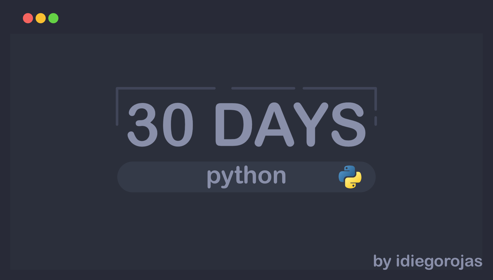

# 30 Días de Python

Reto de 30 días de Python: Un ejercicio y su solución cada día para mejorar mis habilidades de programación en Python.

## Tabla de Contenidos
- Descripción
- Estructura del Proyecto
- Licencia

## Descripción
Reto de 30 días de Python: Un ejercicio y su solución cada día para mejorar mis habilidades de programación en Python.

## Estructura del Proyecto
- `dia-1/`
  - `ejercicio.py`: Descripción del ejercicio del día 1.
  - `solucion.py`: Solución del ejercicio del día 1.
- `dia-2/`
  - `ejercicio.py`: Descripción del ejercicio del día 2.
  - `solucion.py`: Solución del ejercicio del día 2.

## Licencia

Este proyecto está licenciado bajo la Licencia MIT. Consulta el archivo LICENSE para más detalles.
